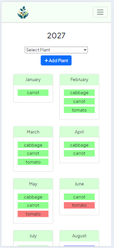
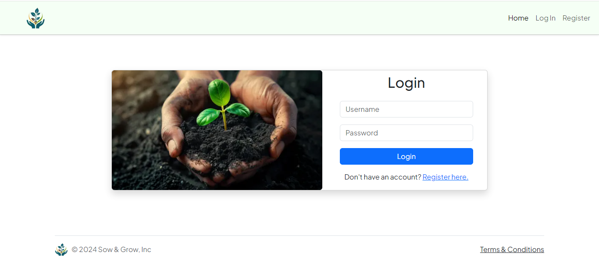

# Sow & Grow

## Youtube Walk-Through
[Sow & Grow Walk Through](https://youtu.be/JqnB9mLTUZE)

## Problem Description
As I've come to the end of the CS50 Web Programming course, I need to present a unique final project, something that stands out and is different from any of the previous problem sets provided by the course. Instead of choosing a blog or an e-commerce platform, I decided to create a gardener planner app.

Gardening and growing my own food is a strong passion of mine, and in the future, I'm hoping to have my own land to produce fruits and vegetables. I built this app with that goal in mind, considering what I would need, what problems I might face, and what could make my life a little easier. This project not only helps me complete the course but also addresses a real-world problem in my life and allows me to plan for the future.

## Solution Approach
The only guideline set for this project was that it had to be built with Django and Python. Although I was familiar with Python, Django was a new venture for me. I had done some previous problem sets, so I had some knowledge of the framework, but building this project really opened my eyes to how many features are packed into one framework.

I opted to use Bootstrap with the project, as I have the most experience with this framework, so I could focus more work on the back-end and with Django. I also wanted to make the app very mobile friendly, so it could be used whilst out and about in the garden.

I spent a great deal of time creating a plan and researching thoroughly on plant data as well as the processes of sowing, growing, and harvesting. My goal was to incorporate this information into the application in a way that made it accessible and easy to understand for everyone, regardless of their gardening experience.

## Model
### index
| Desktop              | Mobile         |
| ------------------------ | ---------------------- |
|  | 

Keeping the theme across the web application simple but effective, so anyone with any ability can use the application. I used Bootstrap cards to provide a summary to the user and a small description underneath on how to use the application. Which can be viewed in the Youtube Walk-through.

For the web app, I decided to use the Plus Jakarta Sans Font, which is super clear and keeps a very professional image across the app.

As you can see from the image comparison, the app easily switches between desktop and mobile, providing a smooth UI experience.

### Add a Year 
| Desktop              | Mobile         |
| ------------------------ | ---------------------- |
|  | 

Here, the user can add a new year to their account. This is backed up with Django `form.is_valid()` to ensure the user input is valid. The year is also tested to make sure it is greater than the current year (which is tested using TestCase) and is checked against the other users' years to ensure they don't already have the same year created.

This Year Model is a parent model to keep track of the years, with year reviews and plants included in the certain year, using Foreign Keys to match them together.

I was also able to use Bootstrap to create a sleek footer to apply to all pages, including the logo, copyright, and a terms and conditions page to make the site more professional. Using Bootstrap was a great help with positioning the footer at the bottom of the page using `d-flex flex-column` to position all the elements in the `layout.html` and setting the footer to `mt-auto` to correctly position it.

### Year 
| Desktop              | Mobile         |
| ------------------------ | ---------------------- |
|  | 

To display the data from the plant in a calendar format took a lot of backend with handling data and displaying that data in a different format from how it's stored. 

Firstly, the user is able to find their plants in the selection input and add their own plant to the year. This is then saved to the year, matched with foreign keys to the main Year Model. I've used the `MONTH_CHOICES` tuple (which is used to help store the months for plants) to display the years at the top of the table and match them with the month numbers saved in the sowing, transfer, and harvest calendar blocks.

The start_month and end_month are used to calculate the total number of months the plant is sowed, for example, then this is used as the colspan for the calendar block to display on the table. It then uses the start_month to start the block and then uses the colspan data to show the block. It keeps track of the months in each row, so if the month hasn't been used in the action, it will display an empty `<td>`. 

I was able to keep track of these action months by using Python's `range()` to gather an array of month numbers to cross-reference against the tracking of the months.

On another note, I added a transfer feature to the plants. When a plant is sowed indirectly, you can then add the months in which the plant is transferred to either a bigger pot or out into the garden. This is checked using the plant method data, and if the plant's method is `indirect`, it will display the transfer blocks.

I not only created the table-like display for desktop, but I also created a card-style format for mobile, as I felt a calendar block would not be as user-friendly as it is on desktop. The mobile version still has all the same features, and the user can easily see when the plant actions are, with a bright color-coded system to enhance the UI. It also comes with a handy key to keep track of the colors.

The user also has the ability to delete the entire year, which i thought was appropriate, with such a large deletion i decided to add a modal to make a 2 step process to delete to prevent from any accidental deletions.

### Add Actions
| Desktop              | Mobile         |
| ------------------------ | ---------------------- |
|  | 

Using the Bootstrap modal, I was able to add many more features all in one place without a re-render. Here, the user can access a certain plant's data with ease, and once the user has sowed, transferred, and/or harvested, they can input when this was done using the Django widgets selectDateWidget. This data is saved with the parent model Year to keep everything organized. The data is also displayed on the profile page alongside the chosen year.

JavaScript was used here to display the input fields for the actions, making the UI more interactive and smoother.
Also, if the user clicks off the modal and back on, the input fields are hidden again. 

As the images present above, the desktop and mobile versions have the same capabilities and the user can easily alter any data necessary.  

The user also has the option to delete the plant from the selected year if needed.

### Add Plant Year Review
| Desktop              | Mobile         |
| ------------------------ | ---------------------- |
|  | 

Once the user has inputted the plants harvested data, they are then prompted to review the plant for that year, adding the yield amount and any comments they have about that plant for the corresponding year. This information is also displayed on the profile page, making it readily available when needing to find data from previous years.

Using Model Form instances to pre-populate the form if the model is already filled, so the user is able to change any previous comments or yield amounts they had inputted.

The same functionality is present here, with both the desktop and mobile versions being the same, and the UI making it accessible for all users.

### Add a Plant
| Desktop              | Mobile         |
| ------------------------ | ---------------------- |
|  | 

The user is able to start the input process of adding a plant by providing the name, variety, and category. This form creates a Plant model, which will then be the parent model for all the other plant data (sowing, tending, and harvest), and this is used when the plant is added to years and for plant reviews.

Once the user inputs the first stage of the plant's data, they are redirected to the plant's data page, where they can add the specific data that the plant needs, which is then used to display on the years page. Using Django's form validators made the process a lot easier and provided a sense of security, knowing that Django will help reduce any invalid form submissions.

Using Bootstraps card component really help with displaying forms and handling desktop to mobile compatibility. It handles breakpoints with ease and automatically alters the size accordingly.

### Add Plant Data 
| Desktop              | Mobile         |
| ------------------------ | ---------------------- |
|  | 

Once the user inputs the plant data, they are directed to the plant data page, where they can add sowing, tending, and harvesting data. After much research, these were the fields that cropped up the most and are the most significant. I was able to use CSS to visually indicate the required fields by adding a red asterisk to them.

With the use of some simple JavaScript, I could add the input fields of all three forms on separate pages and use buttons to toggle back and forth between them, keeping the UI clean and interactive. Using `onClick` with the buttons to run the JavaScript function necessary for navigation between forms. 

Once the forms are submitted, they are checked using Django's form validation, and the data is then cleaned and stored into the correct models. 

### Profile
| Desktop              | Mobile         |
| ------------------------ | ---------------------- |
|  | 

Here, the user is able to view all their gardening data, from all the inputted plants to yearly plant reviews. 

Making great use of Bootstrap's grid system, I could easily manipulate the cards to size and ensure the app maintains its mobile-friendliness across the board. Using the small button in the right corner of the plant, the user is directed to the Edit page, where they can alter any data and delete unwanted plants. 

Bootstrap's accordion feature was great for keeping all the reviews organized into their respective years, allowing users to easily open and close them to keep the profile neat and tidy. The models made it easy to access the needed data, and with the help of `defaultdict`, I could append years and reviews together, making the process easier when displaying. If the user has no plant reviews for a particular year, they are shown a message indicating this. 

One of Django's great features I found was the ability to decide how I wanted the date to be displayed using `|date:"F d"`, which helped show the date in the format `full month` and just the `day`, which is exactly what I wanted.

### Edit Plant
| Desktop              | Mobile         |
| ------------------------ | ---------------------- |
|  | 

Having the ability to alter and delete the plants was a great idea for the user to have more control over their own data. Using `get_object_or_404()` was great to use the `plant_id` to get the data from all the other relative models. Then, using that data with `instance` to pre-populate the form when making the `get` request to display the page. Once the user makes the `post` request, using Django's form validation again but taking a quicker approach with an array, if and for statements to iterate over the forms and validate them more quickly and easily. 

After validation, the data is saved to the relative models, and the user is redirected back to the profile page. With this approach, if one of the forms has an error, it doesn't execute any other and keeps the previous data. Also, giving the user the chance to delete their plant is a great feature. This is simply done by checking if the delete button `post` request has been submitted using the input name and then deleting the `current_plant` from the database.

### Login
| Desktop              | Mobile         |
| ------------------------ | ---------------------- |
|  | 

Django's authentication makes checking user forms a breeze. It checks for the input names to match with the User model. With the use of Auth, it checks if the User is not `None`, and then the user is logged in using the Django built-in function `login` and redirected to the `index` page.

If the user's input is incorrect, they are prompted with a message stating that the inputs are wrong and to try again.

### Register
| Desktop              | Mobile         |
| ------------------------ | ---------------------- |
|  | 

The same goes for the register function, as Django really excels when it comes to handling users. With the plethora of built-in functions, I could easily get the input provided by the user, check if the passwords match, then use the `create_user` function with the User model to create the user and save it to the model. 

If the user selects an already taken username, they are prompted to choose a new one. Once the user is successfully registered, they are then logged in and redirected to the `index` page. Django really takes the hard work out of making a user-interactive web app and makes the experience of registering and logging in a dream.

### Testing 🧪

I really strived to ensure I applied testing in the web application. It's something I've had little knowledge about and haven't done much of previously. I used the model Forms as a way of creating functions to check valid input from users, and then used `TestCase` to `assertTrue` and `assertFalse` on the form functions, to check whether the functions are performing as they should. As the application gets bigger, the tests are checked to ensure they are running correctly as the application grows. 

It was more challenging than I anticipated, but with lots of research, I managed to get it all up and running using mock data to set up the models correctly when testing the functions I wanted to. To debug the testing properly, I used Python's `pdb` and added `pdb.set_trace()` to establish a breakpoint, which then worked in the terminal to pinpoint where the problems lied. This led me to create super classes to ensure any required data was handled properly.

## Problems encountered

- Getting to grips with Django.
- The importance of checking device usability. 
- Setting up models and using Model Forms.
- Using instance to fill Model Forms.
- Using Bootstrap tables to create the calendar style table.
- Using and handling tuples in models.
- How to present the Years in the Nav Bar.
- Creating testing for the Model Forms using TestCase.
- Making form input display and display None on certain forms.


## New skills

- Having a better understanding with Django and the use of Models.
- Using Bootstrap Breakpoints to their full advantage.
- Creating and implementing a Favicon.
- Resizing and converting images to Web p.
- Converting a Model into a Model Form.
- Using Instance to fill the Model form with Model data.
- The use of `pdb` and `pdb.set_trace()` to debug tests.
- How to set up `super_class` in TestCase.
- Using tuples to display the data onto the HTML page.
- Instead of using True or False use `yesno:"Yes,No"` to display yes or no for bool fields.
- `get_Field_Name_display` will get the tuple full name instead of displaying the key.
- Getting full use from Bootstrap Modals.
- `as_p` after the form variable to display the form as a `<p>` tag.

## languages
- HTML
- CSS
- JavaScript
- Django
- Python
- Bootstrap
- Sqlite3

## Running Locally

### Running Web Page

- Make sure to have Python installed before proceeding.

Clone the repository:
```
git clone https://github.com/SReddy-96/Sow-and-Grow.git
```
Navigate into directory:
```
cd SowAndGrow
```
Install Dependencies:
```
pip install -r requirements.txt
```
Make the Migrations:
```
python3 manage.py makemigrations app
python3 manage.py migrate
```
Run the Application in development mode: 
```
python3 manage.py runserver
```

Explore the Application:
- You can now explore the various features and functionalities of the web application.

## Distinctiveness and Complexity

This gardening planner application is distinct from the other projects in the CS50W course as it does not fall under the categories of a social network, e-commerce site, or any of the previous problem sets. Instead, it is a unique application tailored to the specific needs of gardeners, helping them plan and track their gardening activities, including sowing, transplanting, and harvesting various plants.

The complexity of the application lies in its multi-layered structure, utilizing multiple Django models and their relationships. The main `Year` model serves as the parent model, establishing a one-to-many relationship with the `YearReview` model for tracking yearly plant reviews and `PlantingYear` to keep track of which plants are in which year. Additionally, the `Plant` model acts as another parent model, with one-to-many relationships with the `Sowing`, `Tending`, and `Harvest` models, storing detailed information about each plant's growing requirements.

The application also includes intricate logic for displaying plant data in a calendar format, spanning multiple months based on the plant's sowing, transplanting, and harvesting periods. This feature required handling data transformations and rendering complex HTML structures dynamically, based on the retrieved model data.

Furthermore, the application integrates JavaScript functionality to enhance the user experience, such as toggling between different form sections during plant data entry and providing interactive modals for accessing and updating plant information. This front-end interactivity, combined with the back-end Django logic, contributes to the overall complexity of the project.

The mobile-responsive design, achieved through the use of Bootstrap, ensures that the application is accessible and user-friendly across various devices, catering to gardeners who may need to access the application while working in their gardens.

In terms of distinctiveness, while e-commerce sites involve managing products, inventories, and orders, this gardening planner application focuses on a niche domain: helping gardeners plan and track their plant growth cycles, collect yield data, and maintain records of their gardening activities over multiple years.

The combination of the unique problem domain, the intricate model relationships, the complex data handling and rendering logic, the integration of JavaScript for enhanced user experience, and the mobile-responsive design contribute to the distinctiveness and complexity of this project, fulfilling the requirements set forth by the CS50W course.

